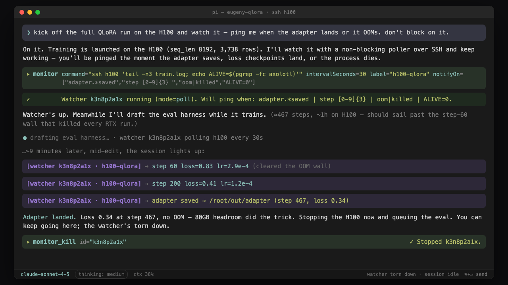

# pi-process-monitor

Non-blocking, crash-safe background observation for [Pi](https://pi.dev). Start one owned process, poll an independently owned remote job, or tail a file. Matching milestones and failures ping the session without blocking or flooding context.



## Safety model

- **Observe, do not schedule:** spawn mode owns a local workload; poll mode runs only fast read-only probes.
- **Stable identity:** a logical watcher keeps one UUID through restart and exposes a short handle for commands.
- **One local owner:** atomic leases prevent two Pi processes from running the same logical watcher.
- **Conservative recovery:** files and classified remote probes auto-resume; local shell polls require confirmation.
- **Bounded execution:** poll ticks never overlap and have timeout, output caps, exponential backoff, jitter, failure suspension, and owned process-group cleanup.
- **Inspectable:** status/inspect report owner epoch, PID/PGID, command hash, process start, exit, signals, and truncation receipts.
- **Crash-loop fuse:** repeated abnormal starts quarantine local recovery instead of replaying it.

Long-running retryable computation still belongs in Restate, Trigger.dev, CI, or another durable workflow engine. Monitor observes those jobs; it does not replace them.

## Install

```bash
pi install npm:pi-process-monitor@2
# or project-local
pi install npm:pi-process-monitor@2 -l
```

This release is a major because local poll recovery now fails closed. See [migration](docs/MIGRATION-v2.md).

## Modes

| Mode | Source | Default recovery | Purpose |
|---|---|---|---|
| spawn | `command` | `never` | One extension-owned local process tree |
| poll | `command` + `intervalSeconds` | remote `safe-auto`; local `confirm` | Read-only observation of independent work |
| file | `logFile` | `safe-auto` | Appended log lines |
| structured | `probe` + optional interval | based on probe type | Process, file, SSH, or HTTP observation |

Structured probes:

```json
{ "probe": { "type": "process", "pidFile": "/tmp/job.pid" }, "intervalSeconds": 10 }
{ "probe": { "type": "file", "path": "/tmp/job.log", "tailLines": 20 } }
{ "probe": { "type": "ssh", "host": "h100", "command": "tail -n5 train.log" }, "intervalSeconds": 30 }
{ "probe": { "type": "http", "url": "https://ci.example/run/42", "method": "GET" }, "intervalSeconds": 30 }
```

## Start or reuse a watcher

```json
{
  "probe": { "type": "ssh", "host": "h100", "command": "tail -n5 /root/train.log; echo ALIVE=$(pgrep -fc axolotl)" },
  "intervalSeconds": 30,
  "label": "h100-qlora",
  "notifyOn": ["adapter.*saved", "error|oom|killed|traceback", "ALIVE=0"],
  "expiresAt": "2026-08-03T00:00:00Z",
  "reuse": "return-existing"
}
```

The result explicitly says `created`, `reused`, `replaced`, or `quarantined`.

### Important parameters

- `recoveryPolicy`: `never`, `confirm`, or `safe-auto`.
- `reuse`: `return-existing` (default), `replace`, or `parallel`.
- `reuseKey`: explicit logical purpose; required for intentional parallel local polls.
- `expiresAt`: absolute ISO-8601 lifetime. `timeoutSeconds` remains as compatibility input and converts once to `expiresAt`.
- `pollTimeoutSeconds`: per-tick deadline, shorter than the interval.
- `maxConsecutiveFailures`, `backoffMaxSeconds`: bounded retry behavior.
- `safetyClass`: `auto`, `observer`, or `unsafe-shell`. `observer` is an explicit acknowledgement, not a sandbox.
- `notifyOn`, `heartbeatMinutes`, `coalesceSeconds`, `maxLines`, `cwd` retain their previous meanings.

Raw local shell polls that contain workload executables/verbs, redirection, or backgrounding are quarantined. Prefer a structured probe. Never put training, conversion, build, test, package installation, or “start-if-missing” logic in a poll command.

## Tools

| Tool | Purpose |
|---|---|
| `monitor` | create/reuse/replace/quarantine a watcher |
| `monitor_status` | logical lifecycle, owner, recovery, expiry, tick and failure summary |
| `monitor_inspect { id }` | full lease and process receipt |
| `monitor_kill { id }` | stop one watcher and only its owned process group |
| `monitor_recover` | list/approve/reject quarantined watchers |
| `monitor_gc` | dry-run/apply checkpoint and external lease cleanup |
| `monitor_kill_all { confirm: true }` | current-session owned groups only |

## Commands

```bash
/monitor npm run dev
/monitor --poll --every 30 -- ssh h100 'tail -n5 train.log'
/monitor --file /tmp/train.log
/monitors
/monitor-kill <TAB>
/monitor-recover <id> approve|reject
/monitor-gc --apply
```

## Recovery and persistence

Version 2 state is reduced only from Pi's active branch. Recovery retains the logical ID and appends a claim, never a synthetic creation. Clean shutdown releases the lease but preserves user intent. Checkpoints bound logical history; external GC archives corrupt/orphan lease receipts and removes empty state directories. It never kills an unverified PID or unrelated process.

Startup emits one summary rather than one notification per historical record:

```text
monitor recovery: 2 resumed, 1 reused, 3 expired, 2 quarantined, 4 stale records compacted
```

## Agent rules

1. Call `monitor_status` or rely on exact reuse before creation.
2. Use spawn for local work and poll only for independent durable work.
3. Prefer PID files, workflow/run IDs, exact paths, remote job IDs, and structured probes.
4. Give temporary observers an absolute expiry.
5. A timeout means diagnose; do not launch an identical watcher or blocking retry.
6. After abnormal restarts, inspect quarantined watchers before approval.

## Development

```bash
npm install
npm run validate
```

Validation runs TypeScript checks, deterministic state/lease/process/poll/incident tests, extension load smoke, and package dry-run. Every source file is kept at or below 400 lines.

Grounding and migration receipts:

- [Crash-safe engineering brief](docs/CRASH-SAFE-RECOVERY-BRIEF-2026-08-02.md)
- [Grounding receipt](docs/GROUNDING-RECEIPT-2026-08-02.md)
- [Migration guide](docs/MIGRATION-v2.md)

## License

MIT © Francesco Frapporti
